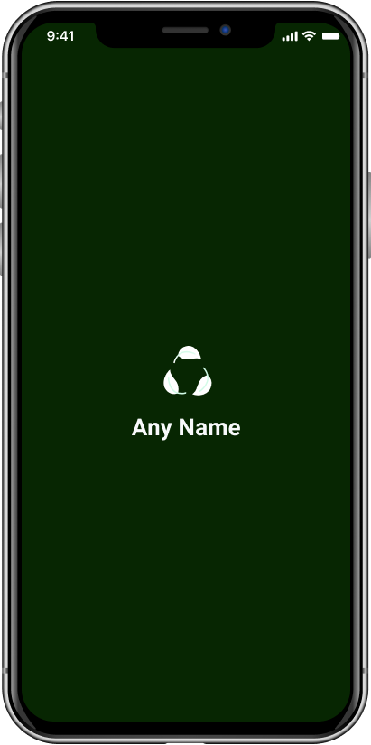
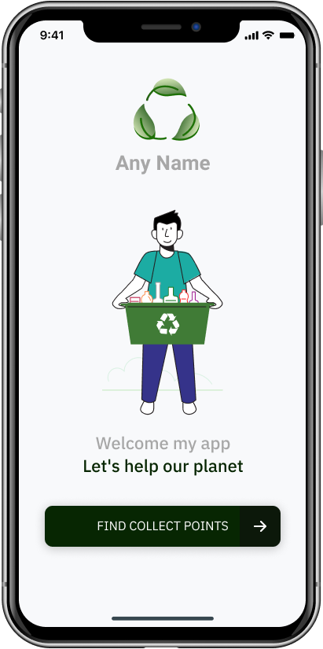
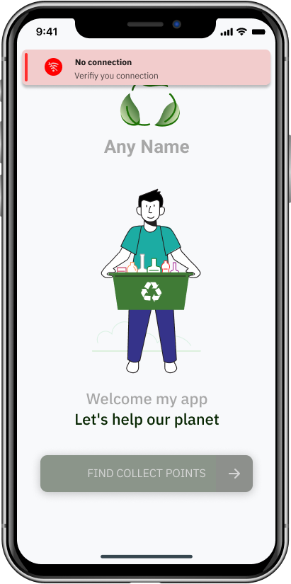
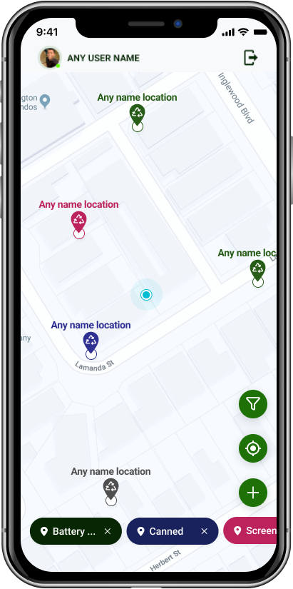
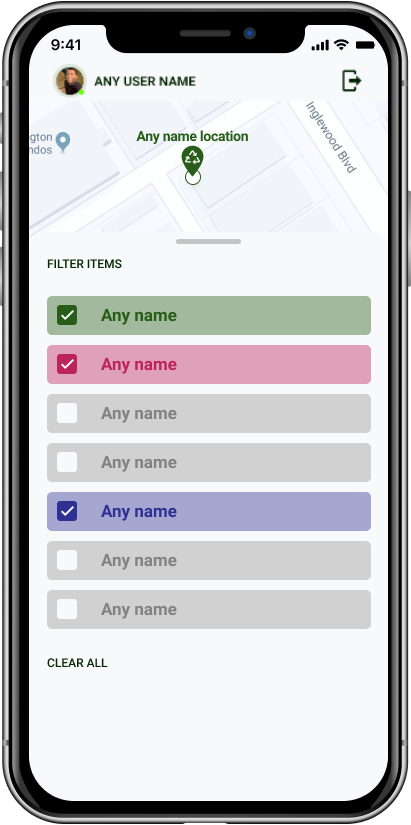

<h1 style="display: flex; align-item: center; justify-content: center; font-weight: bold" align="center">Mobile - TCC Eric Silva </h1>

---

Esta Aplicação faz parte do TCC de Eric Silva.
Aplicativo para Android e IOS

## [**Link para a API**](https://github.com/eric218110/back-end-tcc)

> ## Bibliotecas e Ferramentas

* YARN
* React
* React Native
* Expo
* Location
* GeoLocation
* Axios
* Styled Components
* Polished
* Typescript
* Git
* Babel
* Lint Staged
* Eslint
* Standard Javascript Style

> ## Typescript

* TSX - Typescript com React
* POO Avançado
* Interface
* TypeAlias
* Utility Types
* Modularização de Paths
* Build
* Deploy
* Uso de Breakpoints

> ## Layout :)

---

Feito com muito carinho, dedicação e estudos por mim, <a href="https://github.com/eric218110/">Eric Silva</a>

